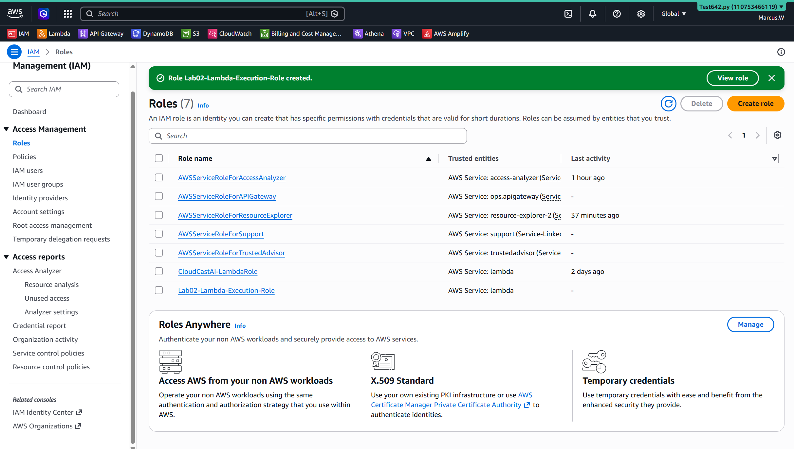
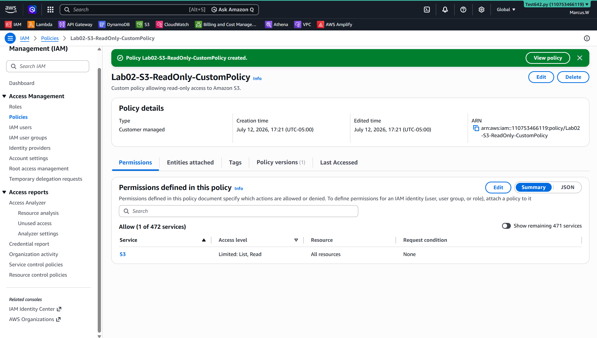

# Lab 02 - AWS IAM Security

## Objective

Design and configure a secure AWS Identity and Access Management environment using users, groups, policies, roles, MFA, and the principle of least privilege.

---

## Business Senario

A company needs to provide AWS access to employee without giving everyone fulladministrative permissions.

The company requires:

- Developers to access only theservicesrequired to do their work
- Auditors to have read-only access
- Administrative access to be protected with MFA
- Permissions to be assigned through groups and roles
- Least- privilege security practices

---

## AWS Services Used

- AWS Identity and Access Management (IAM)
- IAM Users
- IAM User Groups
- IAM Policies
- IAM Roles
- Multi-Factor Authentication (MFA)

---

## Skills Demonstrated

- Identity and Accesss Management
- Least-privilege permissions
- User and Group Administration
- IAM policy management
- Role-based access
- Account security

---

## Architecture Diagram


```text
                         AWS Account
                              │
                 ┌────────────┴────────────┐
                 │                         │
          IAM User Groups             IAM Roles
                 │                         │
        ┌────────┴────────┐                │
        │                 │                │
   Developers          ReadOnly       Lambda Service
        │                 │                │
AmazonS3ReadOnlyAccess  ReadOnlyAccess     │
        │                                  │
 john.developer                 Lab02-Lambda-Execution-Role
                                           │
                               AWSLambdaBasicExecutionRole
                                           │
                                    CloudWatch Logs

Custom policy created:
Lab02-S3-ReadOnly-CustomPolicy
```


---

## Screenshots

### Lambda Execution Role



### Custom IAM Policy



---

## Lessons Learned 

During this lab, I learned how AWS Identity and Access Management controls access to AWS resources.

Key concepts learned:

- Created IAM user grooups to organize permissions by job responsibility.
- Created the 'janine.developer' IAM user and assigned access through the Developer group.
- Attached 'AmazonS3ReadOnlyAccess' to the Developer group.
- Created a ReadOnly group and attached the AWS-managed 'ReadOnlyAccess' policy.
- Learned why permissions should normally be assigned through groups rather than directly to individual users.
- Created the 'Lab02-Lambda-Execution-Role' IAM role for the Lambda service.
- Attached 'AWSLambdaBasicExecutionRole' so Lambda functions can write logs to Amazon Cloudwatch.
- Created a custom IAM policy using JSON.
- Learned the difference between an IAM user and an IAM role.
- Learned that IAM roles provide temperary credentials to trusted users, applications, or AWS services.
- Applied the Principle of least privilege by granting only the permissions required for each task.
- Learned how group-based permissions make access esier to manage as an organization grows.