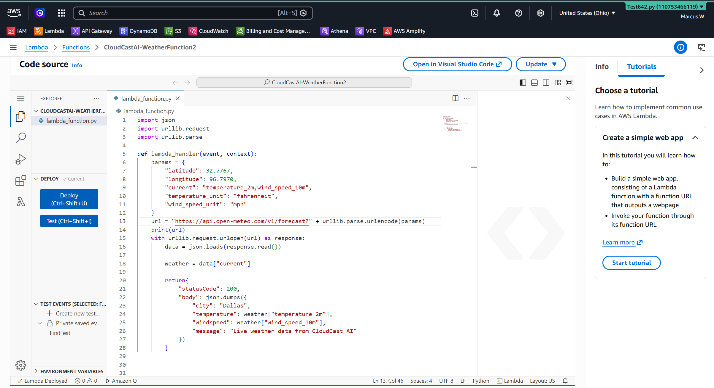
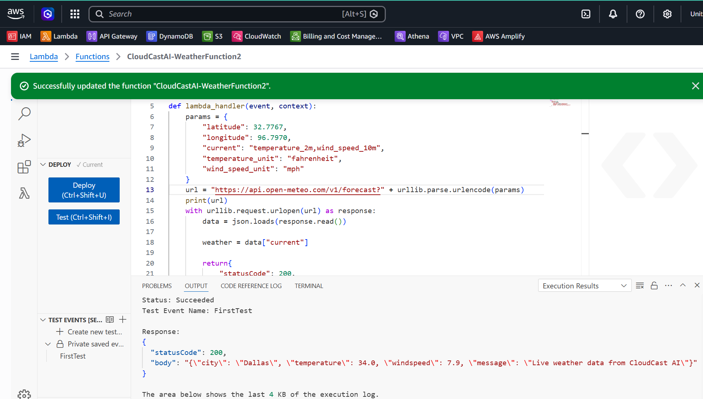
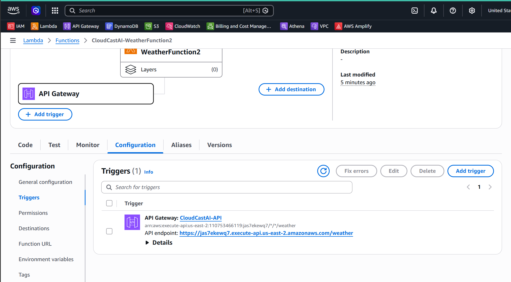
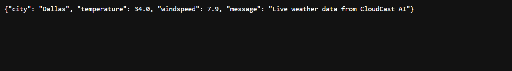

# Lab 03 - CloudCast Serverless Weather API 

## Objective

Design and build a serverless weather application using AWS managed services.

---

## Business Scenario

CloudCast Analytics is expanding its cloud platform by offering weather information through a secure, serverless API.

Customers send requests to the CloudCast API to retrieve current weather data. AWS Lambda processes each request, retrieves frequently accessed weather information from Amazon DynamoDB, stores historical weather data in Amazon S3, and records application logs in Amazon CloudWatch.

The solution must:

- Provide weather data through a secure API
- Scale automatically as customer demand increases
- Minimize operating costs by using serverless services
- Secure access using IAM roles and policies
- Store current and historical weather information
- Capture logs for monitoring and troubleshooting

---

## AWS Services Used

- Amazon API Gateway
- AWS Lambda
- Amzon DynamoDB
- Amazon S3
- Amazon CloudWatch
- AWS IAM

---

## Skills Demonstrated

- Serverless architecture
- API developement
- Event-driven computing
- DynamoDB intergration
- Amazon S3 storage
- CloudWatch logging
- IAM security
- Cost optimization

---

## Screenshots

## Lambda Function

## Lambda Test

## API Gateway

## Browser Response

## Architecture Diagram

 
---

## Lessons learned
During this lab I built a complete serverless weather application using AWS Lambda and API Gateway.

Key concepts learned:

- Created a Python Lambda function to retrieve live weather information.
- Used the Open-Meteo REST API to collect weather data.
- Parsed JSON responses using Python.
- Returned custom JSON output from a Lambda function.
- Tested the application directly from AWS.
- Verified the application from a public browser endpoint.
- Learned how API Gateway acts as the public entry point to the serverless applications.
- Learned that Lambda automatically scales without managing servers.
- Gained experience debugging API requests and correcting HTTP 404 errors.