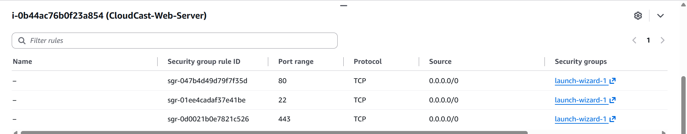
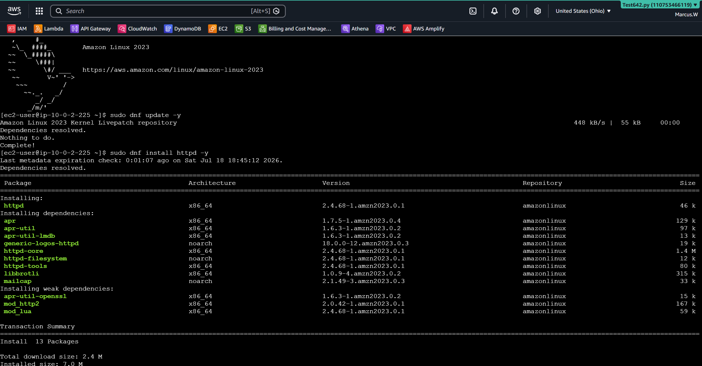
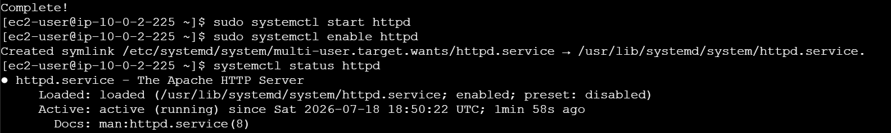
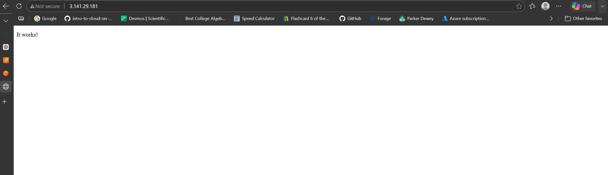
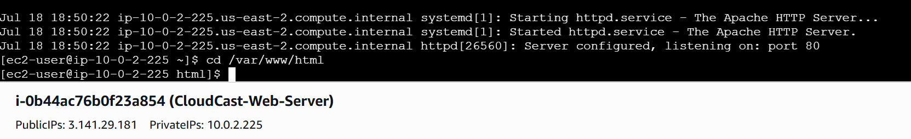
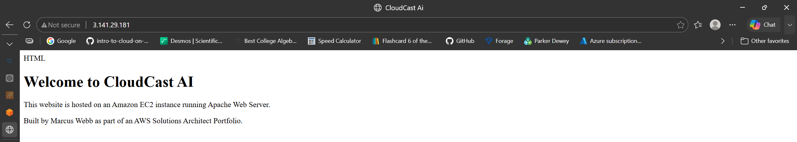
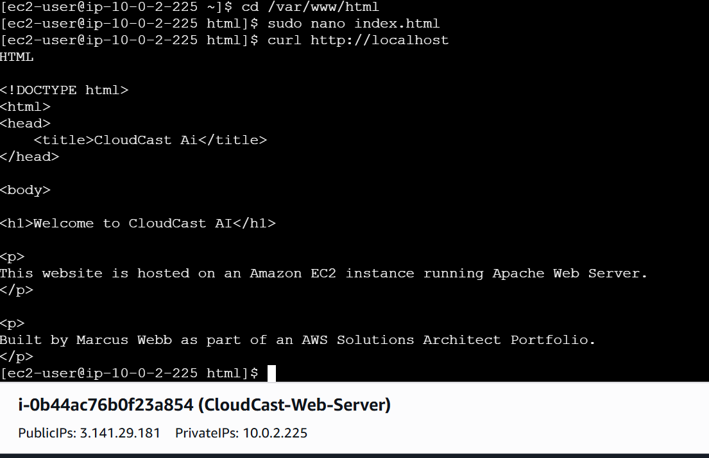

### CloudCast AI – EC2 Web Server Deployment

## Objective

- Deploy a secure Amazon EC2 instance running Amazon Linux 2023
- Install the Apache Web Server
- Host a custom CloudCast AI website accessible over the public internet.

---

Business Scenario

CloudCast AI has successfully developed a serverless Weather API. To improve customer engagement, the company needs a public-facing website where visitors can learn about the company and eventually access its cloud services.

As the AWS Solutions Architect, I deployed an Amazon EC2 web server inside a secure VPC, configured networking and security, installed Apache, and published a custom website.

---

## AWS Services Used:
- Amazon EC2
- Amazon VPC
- Public Subnet
- Internet Gateway
- Route Tables
- Security Groups
- Amazon Linux 2023
- Apache HTTP Server

---

## Skills Demonstrated
- Launching EC2 instances
- Selecting an Amazon Machine Image (AMI)
- Choosing an appropriate instance type
- Creating and using SSH key pairs
- Configuring Security Groups
- Deploying into a custom VPC
- Connecting with EC2 Instance Connect
- Linux command-line administration
- Installing software with DNF
- Managing Linux services with systemctl
- Hosting a static website using Apache

---

## Architechtuere Diagram

                Internet
                    │
                    ▼
           Internet Gateway
                    │
                    ▼
             Public Subnet
                    │
                    ▼
        EC2 (Amazon Linux 2023)
                    │
              Apache Web Server
                    │
          CloudCast AI Website

---

## Screenshots

## EC2 Instance Running

## Security Group Configuration

## Connected EC2 Terminal

## Apache Running

## Apache Default Web Page

## Apache Web Directory

## CloudCast AI Website

## Localhost Verification using curl

---

## Lessons Learned

- Learned how Amazon EC2 provides virtual servers in the AWS Cloud.
- Understood the purpose of Amazon Machine Images (AMIs).
- Configured networking using a custom VPC and public subnet.
- Used Security Groups to control inbound web traffic.
- Connected securely to Linux using EC2 Instance Connect.
- Installed Apache using the DNF package manager.
- Started and enabled Linux services using systemctl.
- Created and deployed a custom HTML homepage.
- Verified the website locally and through a public web browser.
- Gained hands-on experience deploying a production-style web server.

---

## Skills Gained

- AWS Compute
- Cloud Networking
- Linux Administration
- Apache Web Server
- Web Hosting
- Infrastructure Deployment
- AWS Security
- Troubleshooting
- Command Line
- Cloud Architecture

---

## Why This Lab Matters

- This project demonstrates the ability to deploy, configure, secure, and manage an AWS EC2 web server using industry best practices. It builds foundational skills required for Cloud Engineers, Systems Administrators, and AWS Solutions Architects while reinforcing networking, Linux administration, and cloud infrastructure concepts.