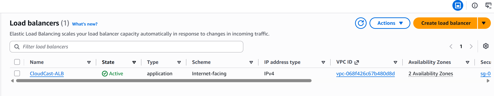
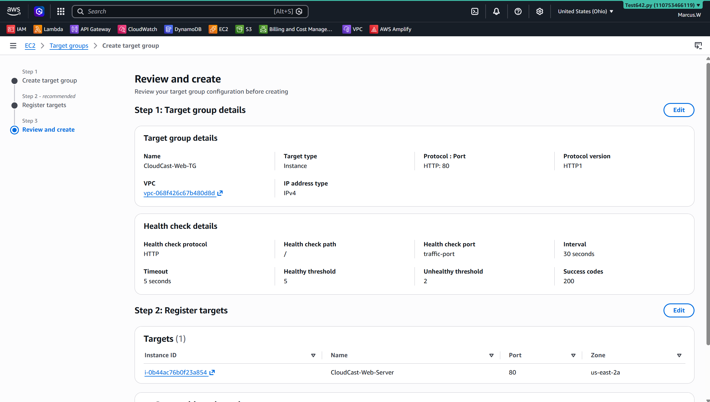
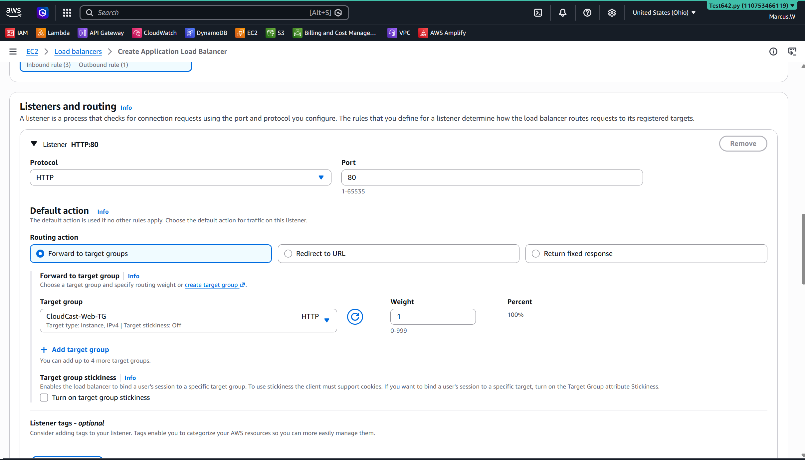
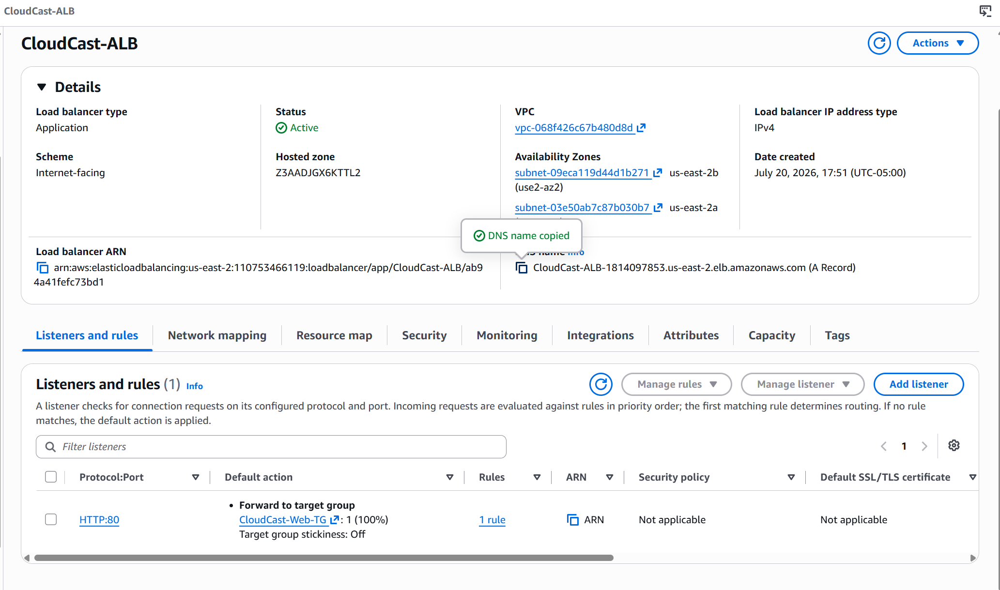

# Lab 05 - Application Load Balancer (ALB)

## Objective

Build a highly available web application by deploying an AWS Application Load Balancer (ALB) in front of an Amazon EC2 web server. Configure a Target Group, perform health checks, and verify that web traffic is routed through the load balancer instead of directly to the EC2 instance.

---

## AWS Services Used

- Amazon EC2
- Application Load Balancer (ALB)
- Target Groups
- Health Checks
- Amazon VPC
- Public Subnets
- Security Groups

---

## Skills Demonstrated

- Deploying an Application Load Balancer
- Configuring HTTP listeners
- Creating and configuring Target Groups
- Registering EC2 instances with a Target Group
- Configuring Health Checks
- Verifying target health
- Routing web traffic through a Load Balancer
- Understanding High Availability architecture
- Troubleshooting load balancer connectivity

---

## Architecture Diagram

```
                 Internet
                     │
                     ▼
        Application Load Balancer
                     │
             HTTP Listener (80)
                     │
                     ▼
           CloudCast-Web-TG
                     │
                     ▼
      Amazon EC2 (Apache Web Server)
                     │
                     ▼
          CloudCast AI Website
```

---

## Screenshots

### Application Load Balancer Created



---

### Target Group Configuration


---

### Healthy Target



---

### Load Balancer Listener



---

### Website Accessed Through the Load Balancer



---

## What I Learned

During this lab I learned how an Application Load Balancer distributes incoming web traffic to healthy EC2 instances through a Target Group. I configured health checks that continuously monitor the web server and learned how AWS automatically removes unhealthy instances from service.

I also learned the relationship between:

- Application Load Balancer
- Listener
- Target Group
- Health Checks
- Amazon EC2

Finally, I verified that users could successfully access my CloudCast AI website using the Load Balancer DNS name rather than connecting directly to the EC2 instance.

---

## Interview Takeaways

This project demonstrates my ability to:

- Build highly available AWS web architectures.
- Configure Application Load Balancers.
- Deploy and manage Target Groups.
- Configure Health Checks.
- Route traffic securely through AWS networking components.
- Troubleshoot load balancing issues.
