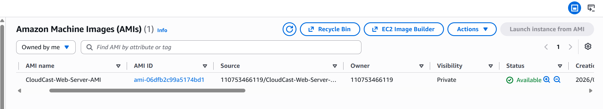
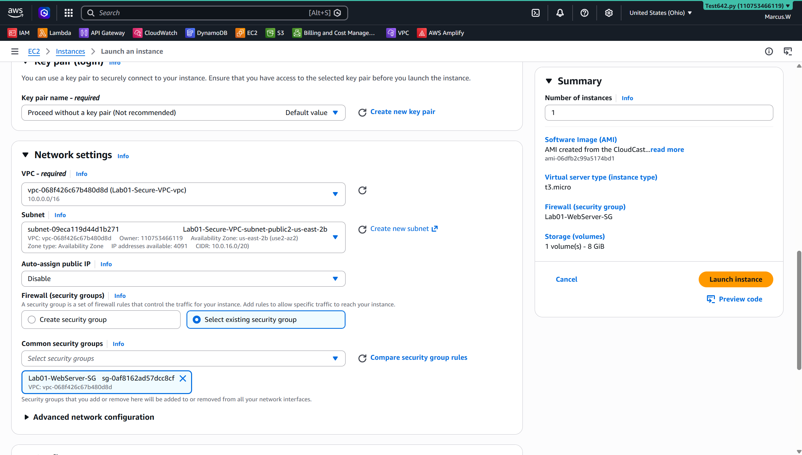
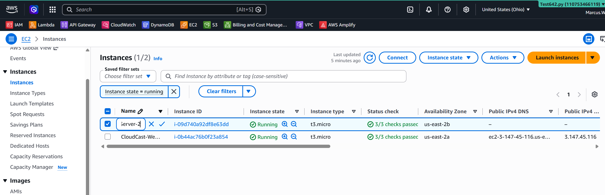
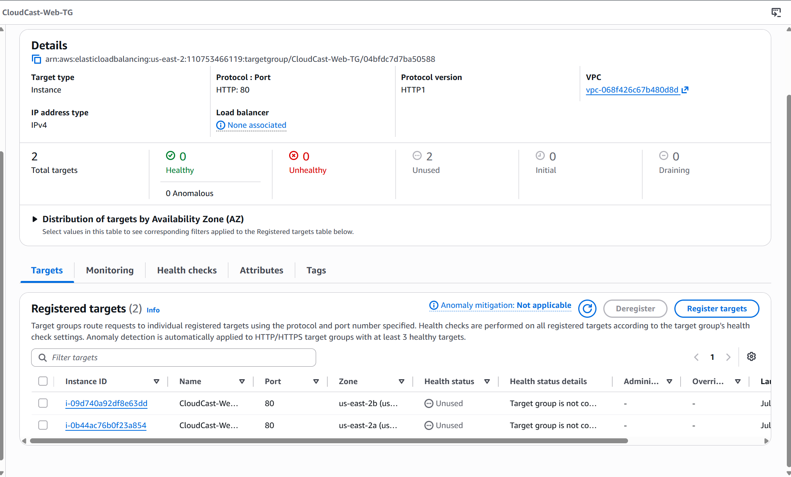
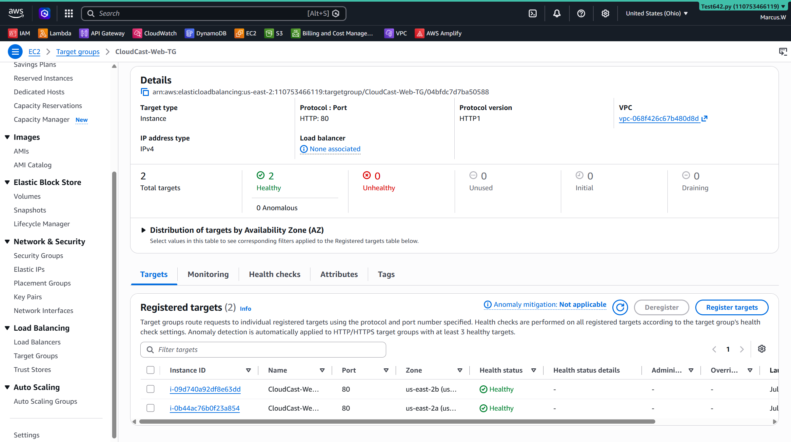

### Lab 06 - High Availability with an Application Load Balancer

## Objective

- The objective of this lab was to build a highly available web application using AWS by deploying two EC2 web servers across multiple Availability Zones and distributing incoming traffic with an Application Load Balancer. The architecture was designed so that if one server becomes unavailable, the application remains accessible through the remaining healthy server.

---

- AWS Services Used
- Amazon EC2
- Amazon Machine Image (AMI)
- Application Load Balancer (ALB)
- Target Group
- Amazon VPC
- Public Subnets
- Security Groups
- Health Checks
- Skills Demonstrated
- Created an Amazon Machine Image (AMI) from an existing EC2 instance.
- Launched a second EC2 instance from the AMI.
- Deployed web servers in two different Availability Zones.
- Configured a Target Group with multiple registered targets.
- Created an internet-facing Application Load Balancer.
- Configured listener rules to forward HTTP traffic.
- Performed health checks on backend servers.
- Built a fault-tolerant, highly available web architecture.

---

Internet
      │
      ▼
Application Load Balancer
      │
      ▼
CloudCast-Web-TG
     /           \
    ▼             ▼
CloudCast-Web-Server      CloudCast-Web-Server-2
    AZ-a                       AZ-b

 ---

 ## Screenshots

 
# AMI Available

# Launch Second Server

# Two Web Server

# Target Group Created

# Healthy Targets

---

## Lessons Learned

- AMIs make it possible to launch identical EC2 instances quickly and consistently.
- Target Groups manage backend servers and perform health checks.
- Application Load Balancers distribute traffic across healthy servers.
- Deploying resources across multiple Availability Zones increases availability.
- Security Groups should be consistent for servers performing the same role.
- Health checks prevent traffic from being routed to unhealthy servers.
- Interview Questions
- Why create an AMI instead of configuring a new EC2 manually?

- Creating an AMI allows identical EC2 instances to be launched quickly while maintaining a consistent configuration and reducing manual errors.

-- Why use an Application Load Balancer?

An Application Load Balancer distributes HTTP/HTTPS traffic across multiple healthy EC2 instances, improving scalability and availability.

-- Why deploy EC2 instances in multiple Availability Zones?

Deploying servers in different Availability Zones improves fault tolerance. If one Availability Zone becomes unavailable, traffic can continue to be served by healthy instances in another Availability Zone.

-- What happens if one EC2 instance fails?

The Application Load Balancer detects the failed instance through health checks and automatically routes traffic only to the remaining healthy instance.

-- What happens if both EC2 instances fail?

The Application Load Balancer has no healthy targets available, so users will receive an error such as HTTP 503 Service Unavailable.

- What I Learned

This lab demonstrated how AWS combines EC2, AMIs, Target Groups, and an Application Load Balancer to create a highly available web application. I learned how traffic flows from users through the load balancer to healthy backend servers and how AWS automatically responds to server failures using health checks.