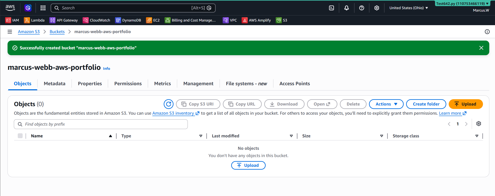

# Lab 07 - Amazon S3 Static Website Hosting

## Objective
Host a static website using Amazon S3.

---

## Architecture

User Browser
      │
      ▼
Amazon S3 Bucket
      │
      ▼
Static Website (index.html)

## AWS Services
- Amazon S3
- Bucket Policy
- Static Website Hosting

## Skills Learned

- Configured an Amazon CloudFront distribution
- Connected CloudFront to an Amazon S3 origin
- Learned how edge locations reduce website latency
- Improved website performance using content caching
- Understood why CloudFront is placed in front of Amazon S3
- Learned a common AWS Solutions Architect architecture pattern
- Gained experience with scalable, globally distributed web hosting

## Screenshots

### Create S3 Bucket

### Enable Static Website Hosting

### Bucket Policy

### Website Running

---

## What I Learned

- During this lab, I learned how Amazon CloudFront works as a Content Delivery Network (CDN) by caching website content at edge locations around the world. Instead of every user connecting directly to my Amazon S3 bucket, CloudFront delivers content from the nearest edge location whenever possible, reducing latency and improving website performance.

I also learned why organizations place CloudFront in front of Amazon S3. CloudFront provides faster content delivery, reduces the number of requests sent directly to the S3 bucket, improves scalability during periods of high traffic, and offers additional security features such as HTTPS support, AWS Shield integration, and AWS WAF compatibility.

This lab demonstrated an important AWS Solutions Architect design pattern: storing static website content in Amazon S3 while using CloudFront as the global content delivery layer. This architecture is highly available, cost-effective, scalable, and commonly used for production websites.