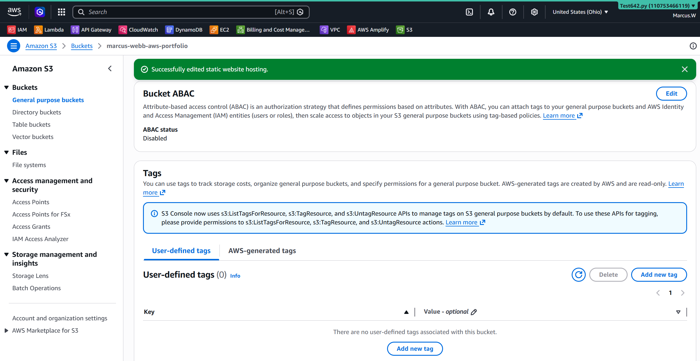
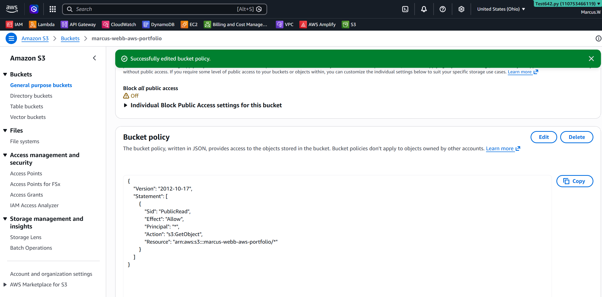
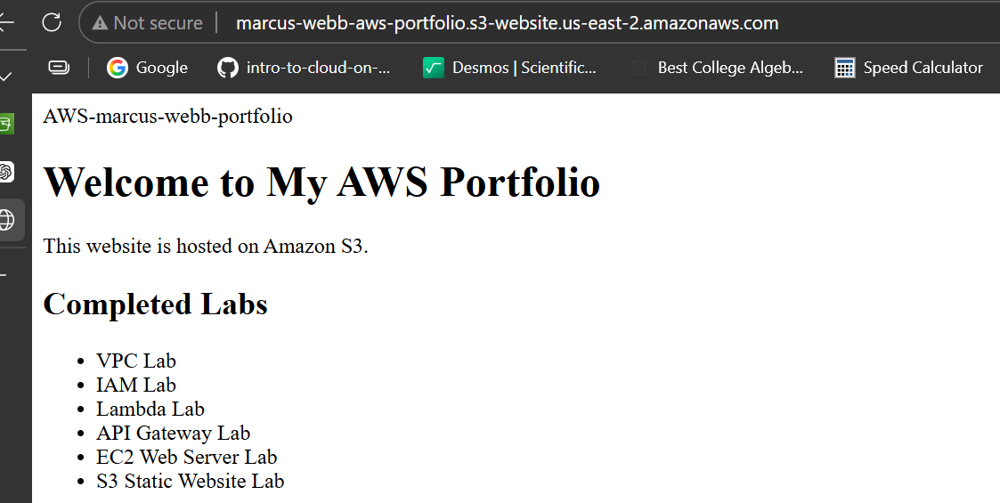

# Lab 07 - Amazon S3 Static Website Hosting

## Objective
Host a static website using Amazon S3.

## AWS Services
- Amazon S3
- Bucket Policy
- Static Website Hosting

## Skills Learned
- Creating S3 buckets
- Uploading objects
- Configuring bucket policies
- Hosting static websites

## Screenshots

### Create S3 Bucket

### Enable Static Website Hosting

### Bucket Policy

### Website Running

